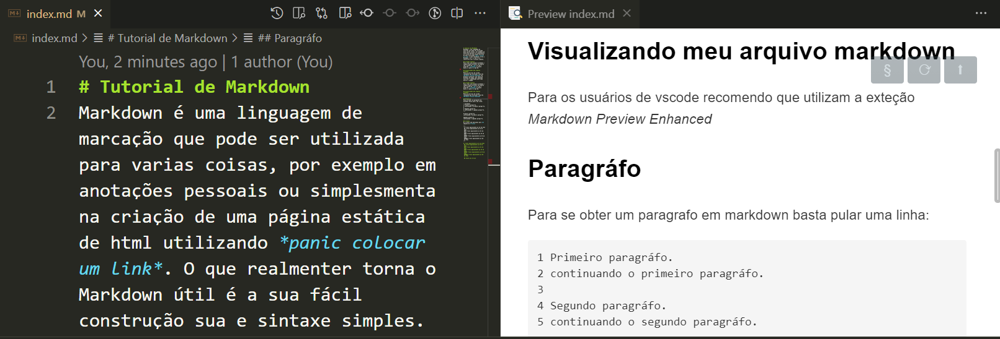

# Tutorial de Markdown
Markdown é uma linguagem de marcação que pode ser utilizada para varias coisas, por exemplo em anotações pessoais ou simplesmenta na criação de uma página estática de html utilizando [Pandoc](https://pandoc.org/installing.html "Página para download do pandoc"). O que realmenter torna o Markdown útil é a sua fácil construção sua e sintaxe simples. 

---
## Criando arquivo
Para criar seu primeiro markdown é simples basta escrever um arquivo com a extenção *.md* ou com a extenção *.markdown* e pronto basta a começar a edição.

---
## Visualizando meu arquivo markdown
Para os usuários de vscode recomendo que utilizam a exteção *Markdown Preview Enhanced* ela permite visualizar seu texto em markdown em tempo real enquando você está trabalhando nele como mostra a imagem.



---
## Paragráfo
Para se obter um paragrafo em markdown basta pular uma linha.

~~~
1 Primeiro paragráfo.
2 continuando o primeiro paragráfo.
3 
4 Segundo paragráfo.
5 continuando o segundo paragráfo.
~~~

Primeiro paragráfo.
continuando o primeiro paragráfo.

Segundo paragráfo.
continuando o segundo paragráfo.

---
## Títulos
Os títulos são definidos pelo *#* seguido do *Título*.

~~~
 # Título equivalente ao h1 em html
 ## Título equivalente ao h2 em html
 ### Título equivalente ao h3 em html
 #### Título equivalente ao h4 em html
 ##### Título equivalente ao h5 em html
 ###### Título equivalente ao h6 em html
~~~

# Título equivalente ao h1 em html
 ## Título equivalente ao h2 em html
 ### Título equivalente ao h3 em html
 #### Título equivalente ao h4 em html
 ##### Título equivalente ao h5 em html
 ###### Título equivalente ao h6 em html

---
 ## Texto em itálico
Para se escrever um texto em itálico basta utilizar _*_ _*_ ou *_* *_* colocando o texto na parte interna.

~~~
1 *texto em itálico 1*
2 _texto em itálico 2_
~~~

*texto em itálico 1*
_texto em itálico 2_

---
 ## Texto em negrito
 A escrita de um texto em negrito é semelhante ao em itálico com algumas pequenas mudanças. Para deixar em negrito use _**_ _**_ ou *__* *__* adicionando o texto na parte interna.

 ~~~
1 **texto em negrito 1**
2 __texto em negrito 2__
~~~

**texto em negrito 1**
__texto em negrito 2__

---
 ## Links
 A dicionar links em markdown é muito simples.
 1. Link direto
 ~~~
 1 https://github.com/antoniolisboa
 2 <https://github.com/antoniolisboa>
 ~~~
https://github.com/antoniolisboa
<https://github.com/antoniolisboa>

 2. Link em trecho de texto
 ~~~
 [Antonio Github](https://github.com/antoniolisboa)
 ~~~
 [Antonio Github](https://github.com/antoniolisboa)

 3. Link em trecho de texto com title
 ~~~
 [Antonio Github](https://github.com/antoniolisboa "Minha página no github")
 ~~~
 [Antonio Github](https://github.com/antoniolisboa "Minha página no github")

---
 ## Citações
 Citação é reliazada utilizando o *>* ela pode ser de uma linha ou mutltiplas linhas.

 ~~~
 >Citação de uma linha
 ~~~
 >Citação de uma linha

  ~~~
 >Citação de multiplas linhas
 >Linha 1
 >Linha 2
 >Linha 3
 ~~~
 >Citação de multiplas linhas
 >Linha 1
 >Linha 2
 >Linha 3

---
 ## Lista não ordenada
 Lista de itens não ordenados pode ser feita utilizando _*_ ou *-*.
 ~~~
 * Paises
    * Brasil
    * Portugal
 * Continentes
    * Europa
    * Oceania
 ~~~

 * Paises
    * Brasil
    * Portugal
 * Continentes
    * Europa
    * Oceania

~~~
 - Paises
    - Brasil
    - Portugal
 - Continentes
    - Europa
    - Oceania
 ~~~

 - Paises
    - Brasil
    - Portugal
 - Continentes
    - Europa
    - Oceania

---
## Listas ordenadas
Na descrição de uma lista ordenada utilizamos um número seguide '.'.

~~~
1. Paises
    1.1. Brasil
    1.2. Portugal
2. Continantes
    2.1. Europa
    2.3. Oceania
~~~
1. Paises
    1.1. Brasil
    1.2. Portugal
2. Continantes
    2.1. Europa
    2.3. Oceania

---
## Imagens
Em markdown existe algumas forma de se trabalhar com imagens tanto em repositório local junto com seu texto (no mesmo diretório) ou com imagens online.

1. Para imagens locais adicione suas imagem no mesmo diretório do seu arquivo markdown.

~~~


Exemplo:

~~~


2. Para imagens online basta ter o link da imagem.
 ~~~
 
 

 Exemplo: 
 
 ~~~
 
 
 ---
 ## Tabelas
 Markdown apresenta um recurso de tabelas bem interessante e de fácil construção. 
 
 1. Por padrão as colunas são alinhadas a esquerda.
 ~~~
 Produto | Preço | Add colunas... 
 --------------------------------
 Playstation 5 | 1 rin
 Xbox Series | R$ 3000.00
 Atari | Dinheiro nenhum compra
 ~~~
 Produto | Preço | Add colunas... 
 --------|-------|-----------------
 Playstation 5 | 1 rin
 Xbox Series | R$ 3000.00
 Atari | Dinheiro nenhum compra

 2. Para alinhar uma coluna a direita basta colocar o ':' do lado direito.
 ~~~
 Produto | Preço | 
 --------:|------:
 Playstation 5 | 1 rin
 Xbox Series | R$ 3000.00
 Atari | Dinheiro nenhum compra
 ~~~
 Produto | Preço | 
 --------:|------:
 Playstation 5 | 1 rin
 Xbox Series | R$ 3000.00
 Atari | Dinheiro nenhum compra

 3. Para centralizar uma coluna basta utilizar ':' tanto do lado direito quanto do esquerdo.
 ~~~
 Produto | Preço | 
 :--------:|:------:
 Playstation 5 | 1 rin
 Xbox Series | R$ 3000.00
 Atari | Dinheiro nenhum compra
 ~~~
 Produto | Preço | 
 :--------:|:------:
 Playstation 5 | 1 rin
 Xbox Series | R$ 3000.00
 Atari | Dinheiro nenhum compra

---
 ## Texto mono-espaçado Inline
 Está é uma das funcionalidades do markdown que eu mais gosto ela nos permite escrever trechos de códigos de forma elegante. Para relizar tal tarefa basta utilizar _```_ ou _~~~_.

 1. Sem cores no código e usando _```_.
 ~~~
 ```
 # Código em python

 def funcao(exemplo):
    print(exemplo)
 ```
 ~~~

 ```
 # Código em python

 def funcao(exemplo):
    print(exemplo)
 ```

2. Sem cores no código e usando _~~~_

 ```
 ~~~
 # Código em python

 def funcao(exemplo):
    print(exemplo)
 ~~~
 ```

 ~~~
 # Código em python

 def funcao(exemplo):
    print(exemplo)
 ~~~

 2. Com cores no código basta adicionar o nome da linguagem ao lado do marcador inicial de código.

 ```
 ~~~Python
 # Código em python

 def funcao(exemplo):
    print(exemplo)
 ~~~
 ```

 ~~~Python
 # Código em python

 def funcao(exemplo):
    print(exemplo)

 class classe():
    num = 0
 ~~~

---
 ## Lista de tarefas
 O markdown apresenta um recurso para criação de lista de tarefas.

  _-_ [ ] Tarefa 1
  _-_ [ ] Tarefa 2
  _-_ [x] Tarefa 3

 - [ ] Tarefa 1
 - [ ] Tarefa 2
 - [x] Tarefa 3

---
 ## Separador de conteúdo
 ~~~
 ---
 ~~~
 ---

---
 ## Considerações finais
 Espero que tenha gostado deste pequeno tutorial sobre markdown. 

 ## Autor
 #### Antonio Carlos de Lisboa
 Estudante de Engenharia da Computação da UTFPR - Universidade Tecnlógica Federal do Paraná.

 Redes Sociais:
 [Linkedin](https://www.linkedin.com/in/antonio-carlos-de-lisboa-549b8a181 "Linkedin Atonio Lisboa")